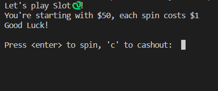

# Slot🐍 - A Simple Emoji-based Slot Machine

A fun and easy-to-play slot machine game built in Python, featuring your favorite emojis.

## Details

**Programming Language**: Python 3

**Modules Needed**:
- `random`
- `time`

## Features

1. Simple console-based UI.
2. Emojis as slot items.
3. Each spin costs $1 with a starting balance of $50.
4. Different payout values for each emoji.
5. Dynamic odds to keep the game interesting.

## Getting Started

### Prerequisites

Ensure you have Python 3 installed on your machine. 

### Installation

1. Clone the repository: git clone https://github.com/Bisalkumar/Slot_Game.git
2. Navigate to the directory and run the game: python game.py

## How to Use

1. Launch the game.
2. Press `<enter>` to spin or type 'c' and press `<enter>` to cash out.
3. The game continues until you choose to cash out or run out of money.

## Screenshots

## Contributions

We welcome contributions to Slot🐍! Please see the CONTRIBUTING.md for more details.

## License

This project is licensed under the MIT License. See the `LICENSE` file for more details.

## Acknowledgement

Thanks to youtube and the community for guidance and suggestions in building this fun project.

